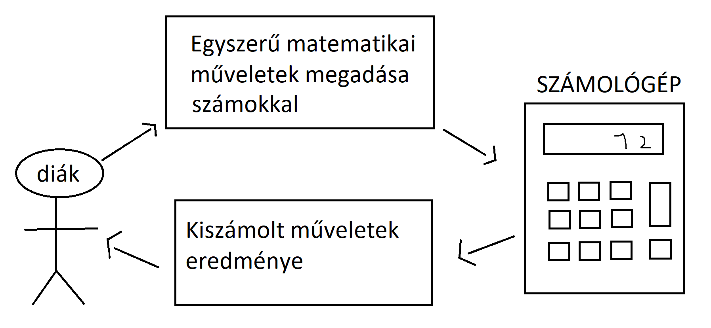
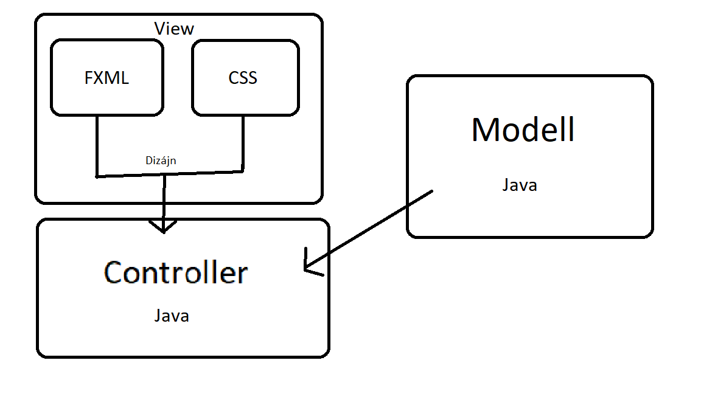

## 1. A rendszer célja

Céljai:

A számológép célja különböző matematikai műveletek elvégzése egész számokkal.

Ezek a műveletek lehetnek összeadás, kivonás stb.

Két számmal való műveletek elvégzése.

Nem célja:

Komplexebb matematikai műveletek elvégzése.

Például:

Egyenlet megoldás.

Gyök keresés egyenlet rendszerben.

## 2. Projektterv

Az MVC informatikai mintát hasznájuk az alkalmazás elkészítéséhez.

Projekt szerepkörök és felelőségek:

Modell:
Kadarkuti Róbert

Controller:
Demeter Benjámin

View(GUI):
Tercza Dávid 

Ütemterv:

Fejlesztés: 2022. 09. 19-23.

Tesztelés: 2022. 09. 24-26.

Határidő: 2022. 09. 26.

## 3. Üzleti folyamatok modellje

## 4. Követelmények

0-9-ig számok használata, és ezekkel való számítás.

Különböző matematikai operátorok használata:

Kötelező operátorok:

K01 Összeadás

Két egészszámnak az összegének kiszámítása.

K02 Kivonás

Két egészszámnak a különbségének kiszámítása.

K03 Szorzás

Két egészszámnak a szorzatának kiszámítása.

K04 Osztás

Két egészszámot elosztva és annak az eredménye.

További operátorok:

K05 Tizedes pont

Tizedes számokkal való számítás.

K06 Karakter törlés

Egy darab karakter törlése a számításból.

K07 Teljes törlés

Az egész számítás nullázása.

K08 Eredmény kiszámítása

Az adott eredmény kiszámítása.

## 5. Funkcionális terv

FELHASZNÁLÓ:

Különböző matematikai operátorok használata:

Összeadás

Kivonás

Szorzás

Osztás

További operátorok használata:

Gyökvonás

Zárójelek használata

Tizedes pont

Karakter törlés

Teljes törlés

Az egész számítás nullázása.

Eredmény kiszámítása

## 6. Fizikai környezet

Az alkalmazás több platformra készül amin elérhető a java.

Kliens által biztosított eszközök:

    - Számítógép

Fejlesztői eszközök:

    - Github

    - Visual Studio Code

    - Eclipse

    - Intelij

    - Notepad++

    - Paint

Tesztelési környezet:

    - Windows

    - Linux

    - MacOS

## 7. Architekturális terv

Az alkalmazást több Java fájl alkotja ezek felelnek a háttérben a számításokért.

A GUI részét egy FXML és egy CSS fájl alkotja.

## 8. Adatbázis terv

## 9. Implementációs terv

Az egész alkalmazás az MVC informatikai mintán alapul ami a Modell,View,Controller.
A Modell összevan kötve a Controller, a Controller pedig a View-val így működik az alkalmazás háttere.

A Modell és Controller Java nyelven van megírva és így működteti az alkalmazás.

A View vagy GUI a felhasználók által látott felület FXML és CSS-ben írodott.

## 10. Tesztterv

## 11. Telepítési terv
Az adott operációs rendszeren telepítve kell, hogy legyen egy Java fordító, ami képes fordítani a file-t.

## 12. Karbantartási terv
