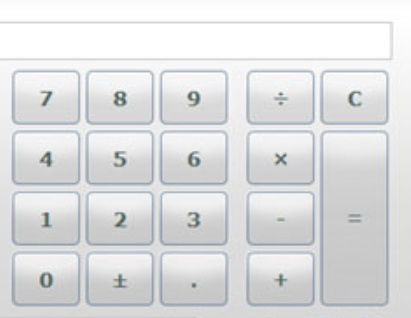

# Funkspec

## 1. A rendszer céljai és nem céljai:

## 2. Jelenlegi helyzet leírása:

## 3. Vágyálom rendszer leírása: 

## 4. Követelménylista:

Különböző matematikai operátorok használata:

Kötelező operátorok:

K01 Összeadás

Két egészszámnak az összegének kiszámítása.

K02 Kivonás

Két egészszámnak a különbségének kiszámítása.

K03 Szorzás

Két egészszámnak a szorzatának kiszámítása.

K04 Osztás

Két egészszámot elosztva és annak az eredménye.

Opcionális operátorok:

K05 Négyzetre emelés

Egészszám négyzetének kiszámítása.

K06 Gyökvonás

Egészszám gyökének kiszámítása.

K07 Zárójelek használata

Zárójel használata.

## 5. Jelenlegi üzleti folyamatok:

## 6. Igényelt üzleti folyamatok:

## 7. Használati esetek:

## 8. Képernyő tervek:

## 9. Fogalomtár:

platformfüggetlen:

 - A platformfüggetlen olyan szoftverekre vonatkozik, amelyek a hardveres és szoftveres konstrukciótól függetlenül működnek, és így hordozhatóak különféle generációs számítógépek és operációs rendszerek között.

 A hordozhatóságot elsősorban a nyílt forráskódú alkalmazások fejlesztői tartják szem előtt, mivel számukra fontos az, hogy az elkészült program mindenki számára hozzáférhető legyen.

Java fordító:

  - A Java fordító a fordító a Java programozási nyelv . 

A Java fordító leggyakoribb kimeneti formátuma a .class fájlok, amelyek a platform agnosztikus Java bytecode-ját tartalmazzák . 

Vannak olyan fordítók is, amelyek egy adott hardver / operációs rendszer kombinációra optimalizált gépi kódot állítanak elő .